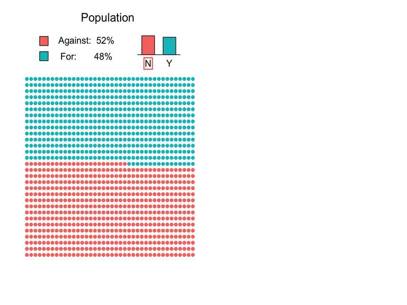
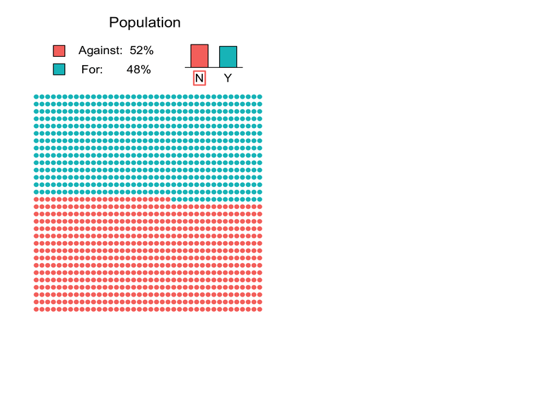
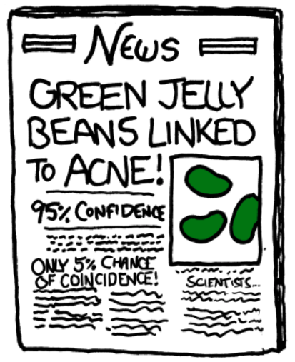
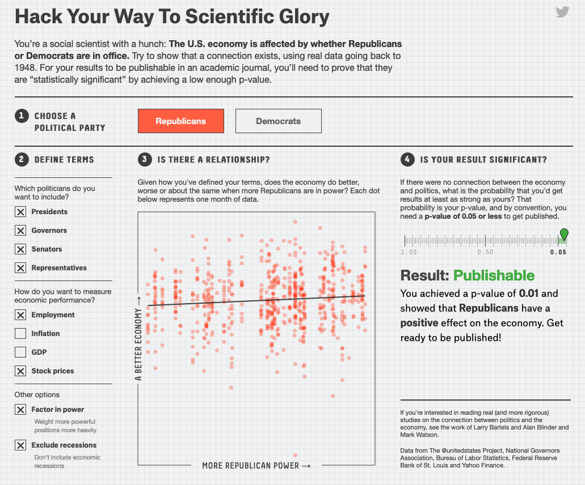

```{R, setup, include = F}
# devtools::install_github("dill/emoGG")
library(pacman)
p_load(
  broom, tidyverse,
  latex2exp, ggplot2, ggthemes, ggforce, viridis, extrafont, gridExtra,
  kableExtra, snakecase, janitor,
  data.table, dplyr, estimatr,
  lubridate, knitr, parallel,
  lfe,
  here, magrittr
)
# Define pink color
red_pink <- "#e64173"
turquoise <- "#20B2AA"
orange <- "#FFA500"
red <- "#fb6107"
blue <- "#2b59c3"
green <- "#8bb174"
grey_light <- "grey70"
grey_mid <- "grey50"
grey_dark <- "grey20"
purple <- "#6A5ACD"
slate <- "#314f4f"
# Dark slate grey: #314f4f
# Knitr options
opts_chunk$set(
  comment = "#>",
  fig.align = "center",
  fig.height = 7,
  fig.width = 10.5,
  warning = F,
  message = F
)
opts_chunk$set(dev = "svg")
options(device = function(file, width, height) {
  svg(tempfile(), width = width, height = height)
})
options(crayon.enabled = F)
options(knitr.table.format = "html")
# A blank theme for ggplot
theme_empty <- theme_bw() + theme(
  line = element_blank(),
  rect = element_blank(),
  strip.text = element_blank(),
  axis.text = element_blank(),
  plot.title = element_blank(),
  axis.title = element_blank(),
  plot.margin = structure(c(0, 0, -0.5, -1), unit = "lines", valid.unit = 3L, class = "unit"),
  legend.position = "none"
)
theme_simple <- theme_bw() + theme(
  line = element_blank(),
  panel.grid = element_blank(),
  rect = element_blank(),
  strip.text = element_blank(),
  axis.text.x = element_text(size = 18, family = "STIXGeneral"),
  axis.text.y = element_blank(),
  axis.ticks = element_blank(),
  plot.title = element_blank(),
  axis.title = element_blank(),
  # plot.margin = structure(c(0, 0, -1, -1), unit = "lines", valid.unit = 3L, class = "unit"),
  legend.position = "none"
)
theme_axes_math <- theme_void() + theme(
  text = element_text(family = "MathJax_Math"),
  axis.title = element_text(size = 22),
  axis.title.x = element_text(hjust = .95, margin = margin(0.15, 0, 0, 0, unit = "lines")),
  axis.title.y = element_text(vjust = .95, margin = margin(0, 0.15, 0, 0, unit = "lines")),
  axis.line = element_line(
    color = "grey70",
    size = 0.25,
    arrow = arrow(angle = 30, length = unit(0.15, "inches")
  )),
  plot.margin = structure(c(1, 0, 1, 0), unit = "lines", valid.unit = 3L, class = "unit"),
  legend.position = "none"
)
theme_axes_serif <- theme_void() + theme(
  text = element_text(family = "MathJax_Main"),
  axis.title = element_text(size = 22),
  axis.title.x = element_text(hjust = .95, margin = margin(0.15, 0, 0, 0, unit = "lines")),
  axis.title.y = element_text(vjust = .95, margin = margin(0, 0.15, 0, 0, unit = "lines")),
  axis.line = element_line(
    color = "grey70",
    size = 0.25,
    arrow = arrow(angle = 30, length = unit(0.15, "inches")
  )),
  plot.margin = structure(c(1, 0, 1, 0), unit = "lines", valid.unit = 3L, class = "unit"),
  legend.position = "none"
)
theme_axes <- theme_void() + theme(
  text = element_text(family = "Fira Sans Book"),
  axis.title = element_text(size = 18),
  axis.title.x = element_text(hjust = .95, margin = margin(0.15, 0, 0, 0, unit = "lines")),
  axis.title.y = element_text(vjust = .95, margin = margin(0, 0.15, 0, 0, unit = "lines")),
  axis.line = element_line(
    color = grey_light,
    size = 0.25,
    arrow = arrow(angle = 30, length = unit(0.15, "inches")
  )),
  plot.margin = structure(c(1, 0, 1, 0), unit = "lines", valid.unit = 3L, class = "unit"),
  legend.position = "none"
)
theme_set(theme_gray(base_size = 20))
# Column names for regression results
reg_columns <- c("Term", "Est.", "S.E.", "t stat.", "p-Value")
# Function for formatting p values
format_pvi <- function(pv) {
  return(ifelse(
    pv < 0.0001,
    "<0.0001",
    round(pv, 4) %>% format(scientific = F)
  ))
}
format_pv <- function(pvs) lapply(X = pvs, FUN = format_pvi) %>% unlist()
# Tidy regression results table
tidy_table <- function(x, terms, highlight_row = 1, highlight_color = "black", highlight_bold = T, digits = c(NA, 3, 3, 2, 5), title = NULL) {
  x %>%
    tidy() %>%
    select(1:5) %>%
    mutate(
      term = terms,
      p.value = p.value %>% format_pv()
    ) %>%
    kable(
      col.names = reg_columns,
      escape = F,
      digits = digits,
      caption = title
    ) %>%
    kable_styling(font_size = 20) %>%
    row_spec(1:nrow(tidy(x)), background = "white") %>%
    row_spec(highlight_row, bold = highlight_bold, color = highlight_color)
}
```

```{css, echo = F, eval = F}
@media print {
  .has-continuation {
    display: block !important;
  }
}
```

# What is statistics?

.pull-left[
.smaller[.hi-pink[Statistics] is a science that uses mathematics and computer science to deal with the collection, analysis, interpretation, and presentation of masses of numerical data. Informally, it is the .pink[science of learning from data]. 🧐]
```{R, stat, out.width = "90%", echo = F}
include_graphics("pics/stat.jpeg")
```
.tiny[Source: [luminousmen](luminousmen.com)]
]

.pull-right[
.smaller[.hi-purple[Statistics] is a crucial part of our life. However, .purple[statistical methods are often consciously (or not) misused] (but how? 🤔). This can lead to contradictory studies and conclusions (as seen during the current COVID-19 pandemic).]

```{R, torture, out.width = "80%", echo = F}
include_graphics("pics/data-torture.png")
```

.tiny[Source: [Atoz Markets](https://atozmarkets.com/news/untold-reality-of-p-hacking-in-finance/)]

]

---

# What is statistical literacy?


.smallest[.hi-pink[Statistical Literacy] can be defined as follows:]
- .smallest[The ability to .pink[understand data], or arguments that use data.]
- .smallest[Being able to apply .pink[critical thinking] about numbers and about .pink[statistics used as evidence in arguments].]
- .smallest[Understanding how statistical associations are used to assess causal connections.]  

.pull-left[
```{R, correlation, out.width = "100%", echo = F}
include_graphics("pics/correlation.png")
```
]

.pull-right[
.tiny[Source: [xkcd](xkcd.com/552)]

👋 .smallest[If you want to know more about these comic strips take a look [here](https://www.explainxkcd.com/wiki/index.php/552:_Correlation).]
]

.smallest[.hi-purple[Statistical literacy is now becoming an essential skill]. It is, for example, needed by .purple[anyone who tries to learn new information from data]. .turquoise[Scientists also need to develop statistical literacy so that they can produce both rigorous and reproducible research.]]

---

# (Mis)Understanding statistical results

```{R, correaltion, out.width = "65%", echo = F}
include_graphics("pics/conditional_risk.png")
```

.tiny[Source: [xkcd](xkcd.com/795)]

👋 .smaller[If you want to know more about these comic strips take a look [here](https://www.explainxkcd.com/wiki/index.php/795:_Conditional_Risk).]

---

# How can statistics be useful?

As mentioned previously, statistics is the .pink[science of learning from data]. It can be used (among others) to:
1. .purple[Visualize data] (e.g. propagation of COVID-19 in different countries).
2. .purple[Understand and interpret data] (e.g. main causes of cancer). 
3. .purple[Make predictions] (e.g. predicting unemployment or risk indices).
4. .hi-pink[Assess the validity of a hypothesis].

In this class, we will focus on the last point:
''.pink[*how to assess the validity of a hypothesis using statistics?*]''. More precisely, we will discuss how statistical methods can be used to evaluate claims (hypotheses) such as:

1. Coffee consumption increases blood pressure (really 🙄 ☕?).
2. Republican politicians are bad/good for the American Economy.
3. A glass of red wine is as good as an hour at the gym (🍷 🏃 😆).

---

# How does it work?

- Statistical methods are based on several fundamental concepts, the most central of which is to consider the information available (in the form of data) resulting from a .hi-pink[random process]. 🙉
- As such, the data represent a .hi-turquoise[random sample] of a totally or conceptually accessible .hi-turquoise[population].

```{R, sampling, out.width = "50%", echo = F}
include_graphics("pics/sampling.png")
```

.tiny[Source: [luminousmen](luminousmen.com)]

---

# How does it work?

- Statistics allows to determine the .hi-pink[decision-making risks] (in the form of probabilities) associated with learning (decisions) based on the analysis of data extracted from samples. .slate[This allows to evaluate the validity of a claim] (such as the ones we discussed previously). 
- .purple[Understanding and knowing how to interpret statistical analyses is therefore becoming an increasingly vital skill].
- In some sense, .hi-pink[statistics plays a crucial role in our life] as new discoveries (obtained using statistical methods) directly impact us<sup>.smallest[👋]</sup>.
- However, understanding statistical results is not intuitive. There exist many pitfalls such as .purple[p-hacking] or .purple[HARKing] (e.g. why are there so many contradictory studies? Is Hydroxychloroquine working or not?).


.footnote[.smallest[👋] This  is essentially true in the area of .hi-purple[Big Data] where the discovery of patterns and/or signals hidden in massive amounts of data is increasingly becoming one of the major challenges faced by modern scientific research.]

---

# So many studies?

.turquoise["*A glass of red wine is as good as an hour at the gym*"?] 🙄

<div align="center">
<iframe width="784" height="441" src="https://www.youtube.com/embed/0Rnq1NpHdmw?start=19&end=50" frameborder="0" allow="accelerometer; autoplay; clipboard-write; encrypted-media; gyroscope; picture-in-picture" allowfullscreen></iframe>
</div>

.tiny[Source: Scientific Studies: Last Week Tonight with John Oliver (HBO)]

---

# Contraditory studies?

.turquoise[What about coffee? Is it good?]

<div align="center">
<iframe width="784" height="441" src="https://www.youtube.com/embed/0Rnq1NpHdmw?start=104&end=199" frameborder="0" allow="accelerometer; autoplay; clipboard-write; encrypted-media; gyroscope; picture-in-picture" allowfullscreen></iframe>
</div>

.tiny[Source: Scientific Studies: Last Week Tonight with John Oliver (HBO)]

---

# So everything causes cancer?

```{R, med2, out.width = "70%", echo = F}
include_graphics("pics/medical_studies2.png")
```

.footnote[.smallest[👋] Read the original article: "*This is why you shouldn’t believe that exciting new medical study*" [here](https://www.vox.com/2015/3/23/8264355/research-study-hype).]

---

# What are the consequences?

.turquoise[Which study should I pick?]

<div align="center">
<iframe width="784" height="441" src="https://www.youtube.com/embed/0Rnq1NpHdmw?start=803&end=889" frameborder="0" allow="accelerometer; autoplay; clipboard-write; encrypted-media; gyroscope; picture-in-picture" allowfullscreen></iframe>
</div>

.tiny[Source: Scientific Studies: Last Week Tonight with John Oliver (HBO)]

---

# The Hydroxychloroquine Controversy 🦠

Since the beginning of 2020, various research teams have suggested that (hydroxy)chloroquine combined with other drugs (e.g. azithromycin) is an .hi-pink[effective treatment] for the coronavirus disease 2019. Since then there have been .hi-purple[many many many contradictory publications] (and some [retractions](https://en.wikipedia.org/wiki/The_Lancet#Retracted_papers_and_scientific_controversies)!) and the efficacy of these drugs remains unclear.

As summarized in the [Wikipedia entry](https://en.wikipedia.org/wiki/Hydroxychloroquine#COVID-19) dedicated to hydroxychloroquine (and citing various scientific sources): .turquoise["*There is no strong scientific evidence to support the use of hydroxychloroquine for preventing or treating coronavirus disease 2019 (COVID‑19)*"].

.hi-pink[So what does this mean?] 🤔 

Does it mean that hydroxychloroquine is not effective in preventing or treating COVID‑19? That it is effective? Actually, neither...  🤔 

---

# Population and Sample - Example

To fix ideas we will consider a simple example. On September 27 2020, the Swiss population voted on the .pink[*Loi fédérale sur la chasse et la protection des mammifères et oiseaux sauvages (Loi sur la chasse, LChP)*]. The proposal was not accepted as it only received 48% of supporting votes<sup>.smallest[👋]</sup>. Suppose that we were interested in collecting data .hi-purple[before the vote] to assess if this proposal was likely to be accepted. In this example, we will make the following assumptions for simplicity:

- The Swiss population of voters is composed of 1200 individuals (576 for the project, 624 against).
- We can perfectly sample the population (everyone is available, no double sampling, and the sampling is random).
- People don't change their mind and they don't lie.

.footnote[.smallest[👋] More details on the results can be found [here](https://www.bk.admin.ch/ch/f/pore/va/20200927/index.html).]

---

# Population and Sample - Example


```{R, sample1, out.width = "92%", echo = F}

```

---

# Population and Sample - Example

```{R, sample2, out.width = "92%", echo = F}

```

---

# Population and Sample - Example

```{R, sample3, out.width = "92%", echo = F}
include_graphics("pics/sample3.jpeg")
```

---

# Population and Sample - Example

.center[]

---

# Population and Sample - Example

```{R, samplen, out.width = "92%", echo = F}

```

---

# How to measure uncertainty?

- .smaller[.pink[Uncertainty can be measured in many different ways]].
- .smaller[A common approach (in statistics) is to use .hi-purple[confidence intervals]]. 
- .smaller[These intervals correspond to .pink[a range of values that are likely to include the population value with a certain level of confidence]. The level of confidence is a probability expressed as a percentage (%).] 
- .smaller[In our example, we are interested in the true (population) proportion of voters in favor of the proposal (48%). Using our second sample (8 against and 12 for) we could construct the following 90% confidence interval]:

.pull-left[
```{R, CI, out.width = "90%", echo = F}

```
]

.smaller[.pull-right[
So what does it mean? 🤔 It means that with a .hi-purple[probability of 90%] the true proportion of voters for the project (48% in this case) is between say 40% and 80%.]
]

---

# How to measure uncertainty?

```{R, sampleci1, out.width = "92%", echo = F}

```

---

# If we had more data? 😳

```{R, sampleci2, out.width = "92%", echo = F}

```

---


# If we had more data? 🤔

```{R, sampleci3, out.width = "92%", echo = F}

```

---

# How to measure uncertainty?

.center[]

---

# How to measure uncertainty?

```{R, samplecin, out.width = "92%", echo = F}

```

---

# Why 90%? Why not 95%?

.center[]

---

# Why 90%? Why not 95%?

```{R, samplecin2, out.width = "92%", echo = F}

```

---

# Is it too much? Maybe 60%?

.center[]

---

# What if I want to be really sure? 99%?

.center[]

---

# A bit more? How about 99.99%?

.center[]

---

# What if I want to be certain? 100%? 😳

.center[]

---

# ⚠️ Take home message

- Since the data is available through sampling, it is .hi-purple[random]. .pink[Therefore, a decision or prediction can never be made with certainty!]
- The only certainty one can have is that, for example, a proportion will always be included in the interval from 0% to 100%. .hi-purple[However, this is neither informative nor useful] 🧐 and it does not even depend on the data.
- There exists a trade-off between .hi-pink[risk] as measured by  1 - $\alpha$ (typically 95%) the confidence level, and the .hi-pink[precision of the conclusion] as measured, for example, by the confidence interval length.
- Moreover, the larger the sample size, the more precise the conclusion, for the same confidence level.
- Therefore, .purple[every decision based on statistical methods has a risk and how much risk is acceptable depends on the context] (e.g. safety in airplanes vs which soft drink tastes better).

---

# ⚠️ At the end it's a question of risk


```{R, risk2, out.width = "85%", echo = F}
include_graphics("pics/risk2.png")
```
.tiny[Source: [xkcd](https://xkcd.com/2333/)]

---

# How to test a (scientific) hypothesis?

- .smaller[An alternative summary measure of uncertainty is provided  by .hi-pink[p-values] that take values between 0% and 100%.]
- .smaller[However, .hi-purple[p-values have been misused] many times because understanding what they mean is not intuitive.]

<div align="center">
   <iframe width="560" height="315" src="https://fivethirtyeight.abcnews.go.com/video/embed/56150342" frameborder="0" allowfullscreen>
   </iframe>
</div>

👋 .smallest[If you want to know more have a look [here](https://fivethirtyeight.com/features/statisticians-found-one-thing-they-can-agree-on-its-time-to-stop-misusing-p-values/).]


---

# How to test a (scientific) hypothesis?

- .smaller[A p-value is associated to a (couple of) .purple[hypotheses] about the phenomenon under investigation. For example, for the voting proposal, one hypothesis is that the majority is against the proposal, and the other one is that there is no majority (the YES and NO are both at 50%)]
- .smaller[Each hypothesis .purple[excludes the other], so that one can .purple[exclude one in favor of the other] using the data.]
- .smaller[The .purple[null hypothesis] is the one that one will never be able to prove because the data is random (i.e. the most precise hypothesis that the votes are 50%-50%.)]
- .smaller[The .purple[alternative hypothesis] is the one that offers more choice of values and hence has a chance to be favored with respect to the null hypothesis (e.g. proportion of NO is smaller than 50%).]
- .smaller[Informally, .hi-pink[a p-value can be understood as a measure of plausibility of the null hypothesis given the data]. The smaller the p-value the greater the incompatibility of the null hypothesis with the data.]

---

# Testing

- .smaller[When the p-value is small enough (typically smaller than 5%), one says that the test based on the null and alternative hypotheses is .hi-pink[significant] or that the null hypothesis is rejected in favor of the alternative. .purple[This is generally what we want because it "verifies" our (research) hypothesis].]
- .smaller[When the p-value is not small enough (typically larger than 5%), with the available data, we cannot reject the null hypothesis and then .hi-pink[nothing] can be concluded. 🤔]
- .smaller[With a sample of data, the obtained p-value (associated to a couple of hypotheses) summarizes somehow the .hi-pink[incompatibility between the data and the model] (random process) constructed under the set of assumptions.]
- .smaller[The (sample) p-value is usually compared to a .pink[threshold value] that sets the (subjective) risk level of decision in favor of the incompatibility.]
- .smaller[The risk level is called the .pink[significance level] and is a small value, usually 5%, but again this depends on the context.]

---

# Testing

```{R, test1, out.width = "90%", echo = F}

```

---

# Testing

```{R, test2, out.width = "90%", echo = F}

```

---

# Testing

```{R, test3, out.width = "90%", echo = F}

```

---

# Testing

.center[]

---

# Testing

```{R, testn, out.width = "90%", echo = F}

```

---

# What to remember about p-values

- .smaller[A p-value is something .hi-pink[random] (i.e. a random variable), since its value depends on the data. Likewise, .pi-pink[confidence intervals are random], since their bounds depend on the data.]
- .smaller[Hence it might happen that, while the null hypothesis cannot be rejected (supposing it is true), the p-value is smaller than the set threshold. With the latter chosen as 5% then, on average, the (sample) p-value is below 5% .purple[one out of twenty times!]]
- .smaller[Hence .hi-pink[performing multiple tests, with the same or different data, is dangerous ⚠️] (but very common! 😟) as it automatically leads to .pink[significant results, when actually there are none!]]
- .smaller[Confidence intervals and p-values can be used for many types of models, such as regression, correlation, and so on. Therefore, .purple[they can be used to assess the validity of most (scientific) hypotheses] (as discussed in your statistics classes! 🤓).]


---

# Why are there contradictory studies?

.purple[Are jelly beans causing acne? Maybe... but why only green ones?] 🤨 

```{R, green, out.width = "45%", echo = F}

```
.tiny[Source: [xkcd](https://xkcd.com/882/)]

---

# Are jelly beans causing acne?

<br>
```{R, green1, out.width = "85%", echo = F}
include_graphics("pics/green1.png")
```
.tiny[Source: [xkcd](https://xkcd.com/882/)]

---

# Maybe a specific color?

<br>
```{R, green2, out.width = "76%", echo = F}
include_graphics("pics/green2.png")
```
.tiny[Source: [xkcd](https://xkcd.com/882/)]

---

# Maybe a specific color?

<br>
```{R, green3, out.width = "75%", echo = F}
include_graphics("pics/green3.png")
```
.tiny[Source: [xkcd](https://xkcd.com/882/)]

---

# And finally...

```{R, greenagain, out.width = "45%", echo = F}

```
.tiny[Source: [xkcd](https://xkcd.com/882/)]

👋 .smallest[If you want to know more about these comic strips take a look [here](https://www.explainxkcd.com/wiki/index.php/882:_Significant).]

---

# This is an example of "P-Hacking"

.smallest[.hi-pink[P-Hacking] refers to the misuse of data analysis to find patterns in data that can be presented as statistically significant. .turquoise[This is done by performing many statistical tests on the data and only reporting those that come back with significant results]<sup>.smallest[👋]</sup>. .hi-purple[Example]: a correlation between the number of letters in [Scripps National Spelling Bee's](https://en.wikipedia.org/wiki/Scripps_National_Spelling_Bee) winning word and the number of people in the United States killed by venomous spiders.]

```{R, phacking, out.width = "82%", echo = F}
include_graphics("pics/phacking.png")
```

.smallest[Source: [Wikipedia on Data dredging ](https://en.wikipedia.org/wiki/Data_dredging)]. 👋 .smallest[If you want to know more, take a look [here](https://www.ncbi.nlm.nih.gov/pmc/articles/PMC1124898/).]

---

# More on P-Hacking 

<div align="center">
<iframe width="784" height="441" src="https://www.youtube.com/embed/0Rnq1NpHdmw?start=209&end=242" frameborder="0" allow="accelerometer; autoplay; clipboard-write; encrypted-media; gyroscope; picture-in-picture" allowfullscreen></iframe>
</div>

.tiny[Source: Scientific Studies: Last Week Tonight with John Oliver (HBO)]

👋 .smallest[If you want to know more, take a look [here](https://fivethirtyeight.com/features/you-cant-trust-what-you-read-about-nutrition/).]

---

# How to P-Hack? 🤔

.smaller[Are republicans good or bad for the American Economy? .hi-purple[Both!!] (see [link](https://projects.fivethirtyeight.com/p-hacking/))]

```{R, rep, out.width = "72%", echo = F}

```

---

# This brings us to "HARKing"

.pull-left[.smallest[.hi-pink[HARKing] is an acronym coined by Norbert Kerr for the .purple[questionable research practice of "Hypothesizing After the Results are Known"]. It can be defined as presenting .hi-turquoise[a post hoc] hypothesis in the introduction of a research report as if it were an .hi-turquoise[a priori] hypothesis.

.hi-pink[How to do it?] 🤔

- Test if one jelly bean color is linked to acne.
- Pretend this was our original hypothesis.
- Et voilà!

👋  If you want to know more, have a look [here](https://en.wikipedia.org/wiki/HARKing) and the references therein.]]


.pull-right[
<br>
```{R, greenagainagain, out.width = "90%", echo = F}

```
.tiny[Source: [xkcd](https://xkcd.com/882/)]
]

---


# The costs of HACKing (and P-Hacking)

HARKing is (arguably) playing an important role in the .hi-purple[replication crisis in science]!  

<br>
```{R, replic, out.width = "80%", echo = F}
include_graphics("pics/replic.jpg")
```

.tiny[Source: [Open Science Collaboration. "Estimating the reproducibility of psychological science." Science 349.6251 (2015)](https://science.sciencemag.org/content/sci/349/6251/aac4716.full.pdf?casa_token=2i_9tsA7a-QAAAAA:B-N4J8bk1hBRboZAmPKuythdhFcdhKKNOtBATZX1PD69qhV-cl1zZG3zcd25LkhnKMpRrmO9TJAxo3f8).]

👋  .smallest[If you want to know more, take a look [here](https://en.wikipedia.org/wiki/Replication_crisis) and the references therein.]

---

# ⚠️ Take home message

- Any data analysis made on a sample of data is subject to .purple[randomness].
- Understanding the random processes underlying any data analysis (including underlying statistics such as confidence intervals and p-values) requires basic knowledge in probability and statistics, or .pink[statistical literacy].
- With data, there is never 100% certainty, but rather a .pink[conclusion associated to a (estimated) risk] that the conclusion might be wrong. 
- .pink[One has to live with this fact, and any scientific result that claims the validity of a result with 100% certainty on the basis of data, is simply a fallacy].
- However, properly controlling for the statistical risk and properly stating the conclusions that can be drawn from a data analysis can really bring new knowledge, especially in all the sciences that are based on observations.

---

# Thank you very much for your attention

.smallest[.center[All material is available on [GitHub](https://github.com/stephaneguerrier/StatLiteracy) at [https://github.com/stephaneguerrier/StatLiteracy](https://github.com/stephaneguerrier/StatLiteracy)]]

<br><br>
```{R, greenagainagainagain, out.width = "37%", echo = F}

```
.tiny[Source: [xkcd](https://xkcd.com/882/)]


